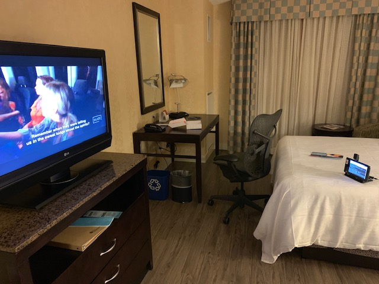

# Toronto Summit 2019 Presentation

*SVC204 Machine Learning at IoT Edge*

## Presentation Slides

[./presentation/SVC204_Machine_Learning_at_the_IoT_Edge_Toronto_Summit_2019.pptx](./presentation/SVC204_Machine_Learning_at_the_IoT_Edge_Toronto_Summit_2019.pptx)

## Demo

* Device HW & SW specs
    * [Raspberry Pi Model B (armv7l)](https://www.amazon.com/Raspberry-Pi-MS-004-00000024-Model-Board/dp/B01LPLPBS8/ref=sr_1_3?crid=3GPWF2AVIWXCE&keywords=raspberry+pi+model+b&qid=1570804951&s=electronics&sprefix=rapsber%2Celectronics%2C177&sr=1-3)
    * [Pi Camera Module V2](https://www.amazon.com/Raspberry-Pi-Camera-Module-Megapixel/dp/B01ER2SKFS)
    * [Raspbian Buster OS](https://www.raspberrypi.org/downloads/raspbian/)
    * [Greengrass v1.9.3](https://docs.aws.amazon.com/greengrass/latest/developerguide/what-is-gg.html#gg-core-download-tab)
    * [Deep Learning Runtime v1.0](https://docs.aws.amazon.com/greengrass/latest/developerguide/what-is-gg.html#gg-ml-runtimes-pc-libs)
    * [MXNet v1.2.1](https://docs.aws.amazon.com/greengrass/latest/developerguide/what-is-gg.html#gg-ml-runtimes-pc-libs)

* Machine Learning [models used in demo (zip)](./models/)
    * MXNet Squeezenet pre-compiled [SqueezeNet](https://github.com/DeepScale/SqueezeNet)
    * SageMaker Neo pre-compiled [Resnet-50](./models/resnet50/)

* AWS Docs How-to [*Perform Machine Learning Inference*](https://docs.aws.amazon.com/greengrass/latest/developerguide/ml-inference.html)
    * Greengrass demo walk-through
    * Custom Local Resources configured
    * Machine Learning Resources configured
    * Subscription setup
    * Lambda deployed with access to Resources (eg. peripherals and models)
    * Pi Camera used to snap photos upon publishing to prescribed IoT Topic

## Screenshots (live demo backup contingency plan)

*The following screenshots using Resnet-50 SageMaker Neo pre-compiled model showing picture snapped and probability of image classified.*

#### Lamp, probability = `0.761`

#### Television, probability `0.751`

Voila!

##### My IoT Edge Setup

*Bonus Minecraft Creeper using Pi SenseHat*

<iframe src="https://trinket.io/embed/python/d48b677e45" width="100%" height="356" frameborder="0" marginwidth="0" marginheight="0" allowfullscreen></iframe>

